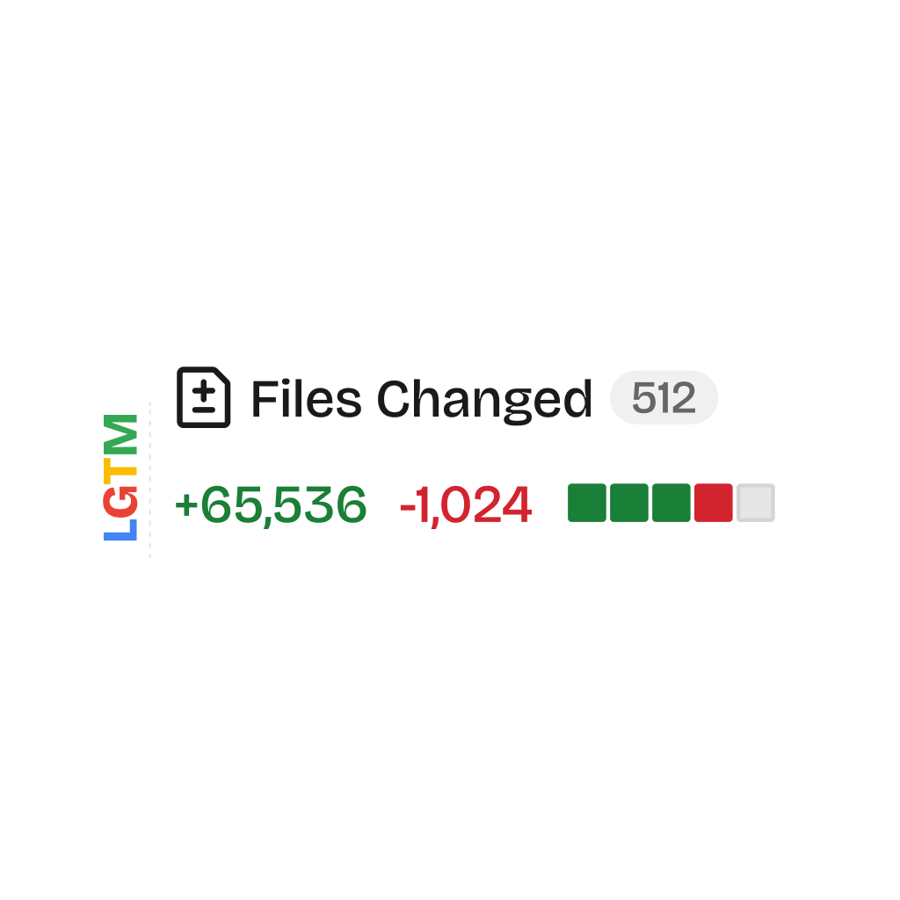
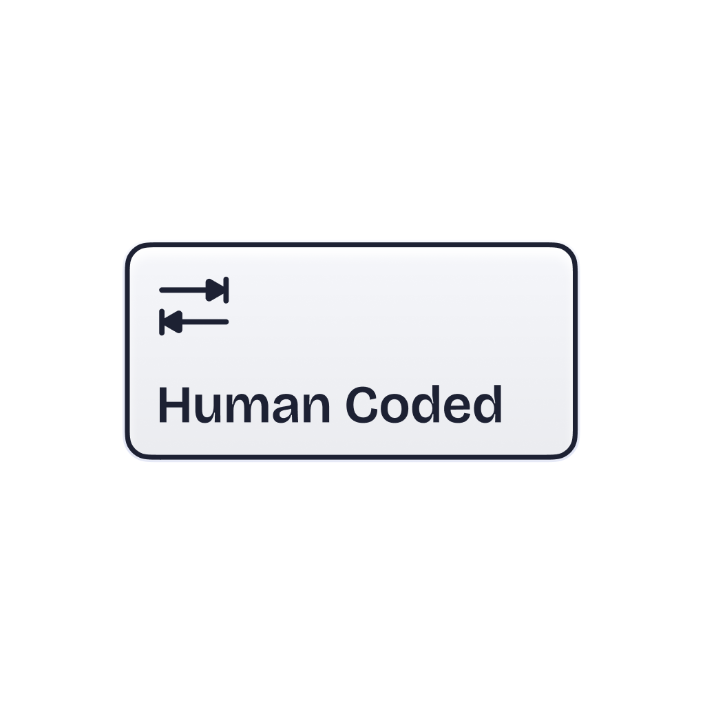
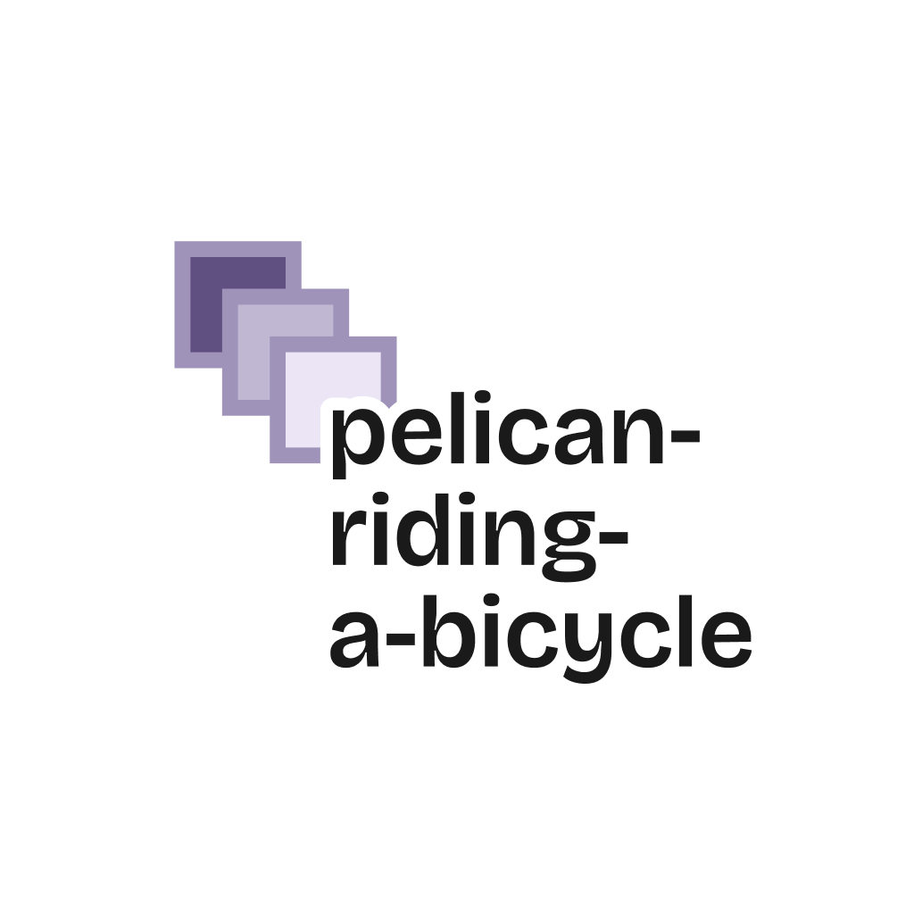
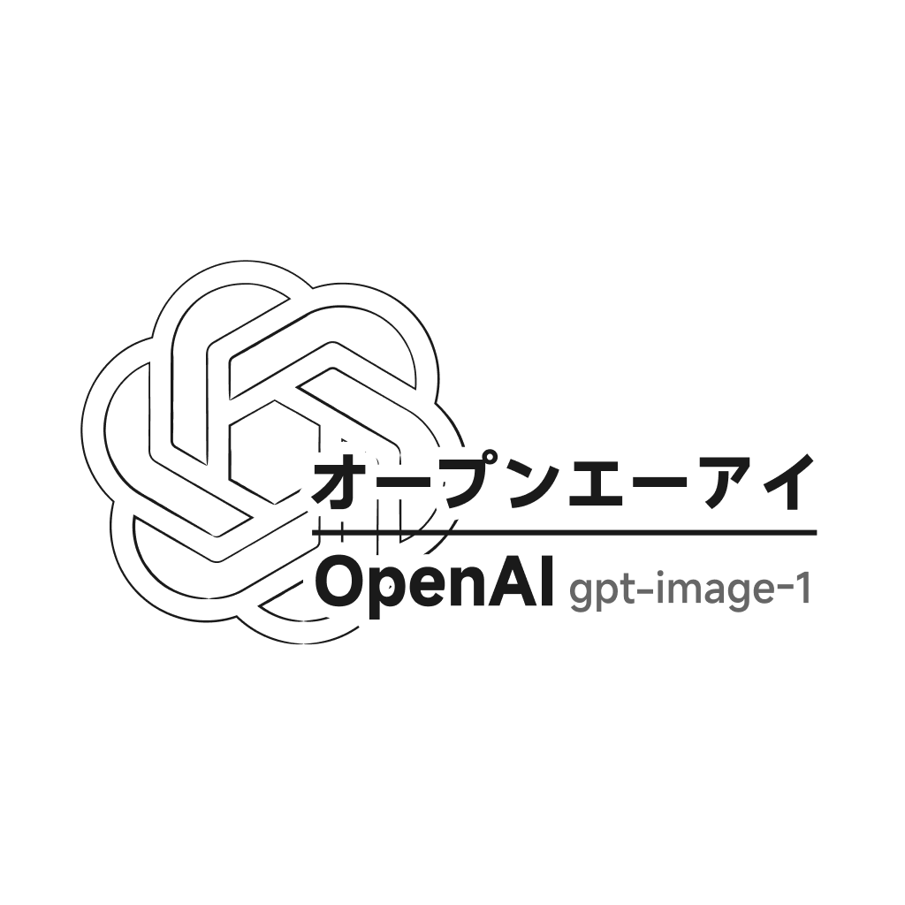
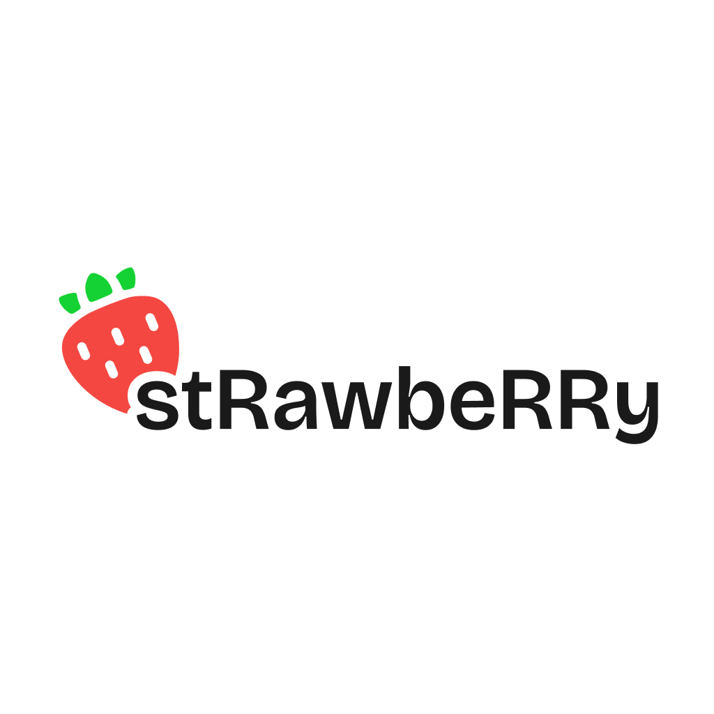

# LLM Things

&nbsp;&nbsp;

 

This repo is a collection of LLM memes including png & svg. Just for kicks.

Got any new ideas? Feel free to open an issue!

 

| Sticker | Description |
| ------------- | ------------- |
|  | People often see this sentence at the beginning of replies in Claude Code. |
|  | These massive pull requests often contain LLM collaboration. |
|  | TIME100 AI 2025, Pliny the Liberator made the cut. Wait, what? |
|  | The longest time in the world. |
|  | If you use Google Translate to translate 'LLM' and 'PNG' into Chinese, you will only get the results 'Master of Laws' and 'Papua New Guinea'. |
|  | The .ai domain is part of Anguilla's fiscal revenue. |
|  | You should ask Adam Wathan, the founder and CEO of Tailwind. |
|  | Humans make mistakes, but that's why we are human. |
|  | Human can press tab. |
|  | As LLMs have advanced, token prices have been falling — except for Anthropic's Claude series. |
|  | Even without Ani, Grok is still popular on X. |
|  | The Chinese in the image means 'Thinking... Oh shit, the user is completely pissed off.' As you can see, DeepSeek model is very popular in China. Users unfamiliar with AI chain-of-thought are curious about what R1 is thinking. This meme came from a user insulting R1, after which the first line of R1's thoughts was that sentence. It became widely spread due to its very colloquial and somewhat humorous tone. |
|  | The Chinese in the picture is 'Good food is worth waiting for'. When Ollama released its desktop application, a Chinese X user asked in Chinese, 'What took you so long?' Ollama, uncharacteristically, replied with an authentic Chinese response. I think this is fun. |
|  | AGENTS.md Like fire, it always existed until discovered by humans, whose population size and habitat range expanded significantly. |
|  | Simon Willison always uses 'pelican-riding-a-bicycle' to test LLM's ability to generate SVG. Of course, most SVGs are very abstract. |
|  | Perhaps because of FOMO, YC has invested in many AI-related companies, even if some of them seem inexplicable. |
|  | Who doesn't love Gemini's Free Tier? |
|  | OpenAI once tried to register the GPT trademark but was rejected. Recently, their applications to register GPT-5, GPT-6, and so on in China also hit a wall, haha. |
|  | I don't think GPT-OSS was launched for the contribution of the open-source community, but rather to appease the public opinion of CloseAI (personal opinion) |
|  | For Stable Diffusion players, Ghibli's LoRA is no stranger. However, GPT-4o (or rather, the subsequent gpt-image-1 API) has pushed it into an internet media frenzy. Currently, it's largely unavailable due to copyright reasons, but Sam Altman still hasn't changed his Ghibli-style avatar. Oh my, who's going to rein in this lowercase letter enthusiast? |
|  | Now everyone basically doesn't let AI count how many r's are in strawberries, but we'll always miss the little strawberry! And the version number. |
|  | Bouncing-ball-test Testing is also one of the LLM's coding ability tests |
|  | MLX is my Mac's savior. |

